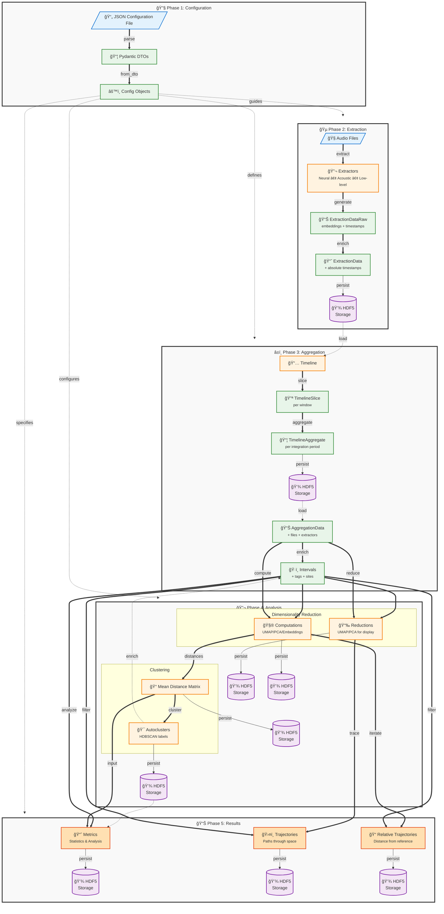

```mermaid
%%{init: {'flowchart': {'rankdir': 'TB', 'nodeSpacing': 50, 'subGraphTitleMargin': {'top': 10}}}}%%
graph TB
    subgraph Phase1["🔧 Phase 1: Configuration"]
        direction LR
        JSON[/"📄 JSON Configuration File"/]
        DTOs["📦 Pydantic DTOs"]
        Config["âš™ï¸ Config Objects"]

        JSON ==>|parse| DTOs
        DTOs ==>|from_dto| Config
    end

    subgraph Phase2["🵠Phase 2: Extraction"]
        direction TB
        Audio[/"🧠Audio Files"/]
        Extractor["🔬 Extractors<br/><small>Neural • Acoustic • Low-level</small>"]
        ExtractionRaw["📊 ExtractionDataRaw<br/><small>embeddings + timestamps</small>"]
        ExtractionData["📈 ExtractionData<br/><small>+ absolute timestamps</small>"]
        StorageE[("💾 HDF5<br/>Storage")]

        Audio ==>|extract| Extractor
        Extractor ==>|generate| ExtractionRaw
        ExtractionRaw ==>|enrich| ExtractionData
        ExtractionData -->|persist| StorageE
    end

    subgraph Phase3["â±ï¸ Phase 3: Aggregation"]
        direction TB
        Timeline["📅 Timeline"]
        Slices["🔪 TimelineSlice<br/><small>per window</small>"]
        Aggregates["📦 TimelineAggregate<br/><small>per integration period</small>"]
        StorageA[("💾 HDF5<br/>Storage")]
        AggData["📊 AggregationData<br/><small>+ files + extractors</small>"]
        Intervals["ğŸ·ï¸ Intervals<br/><small>+ tags + sites</small>"]

        StorageE -.->|load| Timeline
        Timeline ==>|slice| Slices
        Slices ==>|aggregate| Aggregates
        Aggregates -->|persist| StorageA
        StorageA -.->|load| AggData
        AggData ==>|enrich| Intervals
    end

    %% force vertical stacking
    Intervals ==> Reductions
    Intervals ==> Computations

    subgraph Phase4["🔬 Phase 4: Analysis"]
        direction TB

        subgraph DimReduction["Dimensionality Reduction"]
            Reductions["📉 Reductions<br/><small>UMAP/PCA for display</small>"]
            Computations["🧮 Computations<br/><small>UMAP/PCA/Embeddings</small>"]
        end

        subgraph Clustering["Clustering"]
            MDM["📠Mean Distance Matrix"]
            Autoclusters["🯠Autoclusters<br/><small>HDBSCAN labels</small>"]
        end

        StorageR[("💾 HDF5<br/>Storage")]
        StorageC[("💾 HDF5<br/>Storage")]
        StorageM[("💾 HDF5<br/>Storage")]
        StorageAC[("💾 HDF5<br/>Storage")]

        AggData ==>|reduce| Reductions
        AggData ==>|compute| Computations
        Computations ==>|distances| MDM
        MDM ==>|cluster| Autoclusters

        Reductions -->|persist| StorageR
        Computations -->|persist| StorageC
        MDM -->|persist| StorageM
        Autoclusters -->|persist| StorageAC
    end

    %% Force Phase4 -> Phase5 vertical layout
    StorageAC -.-> Metrics

    subgraph Phase5["📊 Phase 5: Results"]
        direction TB
        Metrics["📈 Metrics<br/><small>Statistics & Analysis</small>"]
        Trajectories["ğŸ›¤ï¸ Trajectories<br/><small>Paths through space</small>"]
        RelTrajectories["📠Relative Trajectories<br/><small>Distance from reference</small>"]

        StorageMet[("💾 HDF5<br/>Storage")]
        StorageT[("💾 HDF5<br/>Storage")]
        StorageRT[("💾 HDF5<br/>Storage")]

        Intervals ==>|analyze| Metrics
        MDM ==>|input| Metrics

        Reductions ==>|trace| Trajectories
        Intervals ==>|filter| Trajectories

        Computations ==>|iterate| RelTrajectories
        Intervals ==>|filter| RelTrajectories

        Metrics -->|persist| StorageMet
        Trajectories -->|persist| StorageT
        RelTrajectories -->|persist| StorageRT
    end

    Config -.->|guides| Phase2
    Config -.->|defines| Phase3
    Config -.->|configures| Phase4
    Config -.->|specifies| Phase5

    Autoclusters -.->|enrich| Intervals

    classDef phaseStyle fill:#f9f9f9,stroke:#333,stroke-width:3px
    classDef inputStyle fill:#e3f2fd,stroke:#1976d2,stroke-width:2px
    classDef processStyle fill:#fff3e0,stroke:#f57c00,stroke-width:2px
    classDef dataStyle fill:#e8f5e9,stroke:#388e3c,stroke-width:2px
    classDef storageStyle fill:#f3e5f5,stroke:#7b1fa2,stroke-width:2px
    classDef resultStyle fill:#ffe0b2,stroke:#e64a19,stroke-width:2px

    class Phase1,Phase2,Phase3,Phase4,Phase5 phaseStyle
    class JSON,Audio inputStyle
    class Extractor,Timeline,Reductions,Computations,MDM,Autoclusters processStyle
    class DTOs,Config,ExtractionRaw,ExtractionData,Slices,Aggregates,AggData,Intervals dataStyle
    class StorageE,StorageA,StorageR,StorageC,StorageM,StorageAC,StorageMet,StorageT,StorageRT storageStyle
    class Metrics,Trajectories,RelTrajectories resultStyle
```
